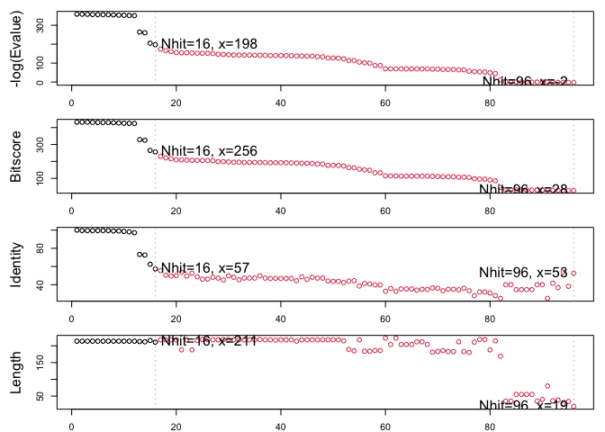

Class 09
================
Tomi Lane Timmins

# 1. Introduction to the RCSB Protein Data Bank

``` r
pdbStats <- read.csv("DataExportSummary.csv")
pdbStats
```

               Molecular.Type   X.ray    EM    NMR Multiple.methods Neutron Other
    1          Protein (only) 152,809 9,421 12,117              191      72    32
    2 Protein/Oligosaccharide   9,008 1,654     32                7       1     0
    3              Protein/NA   8,061 2,944    281                6       0     0
    4     Nucleic acid (only)   2,602    77  1,433               12       2     1
    5                   Other     163     9     31                0       0     0
    6  Oligosaccharide (only)      11     0      6                1       0     4
        Total
    1 174,642
    2  10,702
    3  11,292
    4   4,127
    5     203
    6      22

> Q1: What percentage of structures in the PDB are solved by X-Ray and
> Electron Microscopy.

``` r
pdbStats$X.ray
```

    [1] "152,809" "9,008"   "8,061"   "2,602"   "163"     "11"     

These values are returned with quotations and must be coded as
characters. This means ‘sum(pdbStats\[,1\])’ will not work because. We
must change the values from characters to numerals before any analysis
can be done. The function ‘as.numeric()’ can make the column readable as
numeric values rather than characters.

``` r
as.numeric(pdbStats$X.ray)
```

    Warning: NAs introduced by coercion

    [1]  NA  NA  NA  NA 163  11

‘as.numeric()’ cannot process the commas that are included in the larger
values (ex. the amount of ‘protein-only’ imaged by method of X ray is
‘152,809’) We need to remove these commas to work with the data.

We can use ‘gsub()’ to remove the commas. The ‘gsub()’ function requires
“pattern”, “replacement” and “x”. x is our data.frame, the pattern we
would like to remove is the commas. and the replacement is nothing.

``` r
gsub(",","", pdbStats$X.ray)
```

    [1] "152809" "9008"   "8061"   "2602"   "163"    "11"    

After removing the commas and changing the values to numeric, we can sum
values of each column and figure out what proportion of structures were
solved by EM and X ray diffraction.

``` r
n.xray <- (sum(as.numeric(gsub(",","", pdbStats$X.ray))))
n.xray
```

    [1] 172654

``` r
n.em <- (sum(as.numeric(gsub(",","", pdbStats$EM))))
n.em
```

    [1] 14105

``` r
n.total <- (sum(as.numeric(gsub(",","", pdbStats$Total))))
n.total
```

    [1] 200988

``` r
p.em <- (n.em/ n.total) *100
p.em
```

    [1] 7.017832

``` r
p.xray <- (n.xray/n.total) *100
p.xray
```

    [1] 85.90264

7% of the structures were solved by EM and 85.9% of the structures were
solved by X-Ray diffraction. Together, 92.9% of the structures were
solved by these two methods.

> Q2: What proportion of structures in the PDB are protein?

Similarly, we need to remove the commas and change the values from
characters. If we were going to be doing a longer analysis, we would
write a function to make the code more readable.

``` r
n.protein <- (sum(as.numeric(gsub(",","", pdbStats[1,8]))))

(n.protein/n.total)*100
```

    [1] 86.89175

Approximately 86.9% of the structures are proteins.

> Q3: Type HIV in the PDB website search box on the home page and
> determine how many HIV-1 protease structures are in the current PDB?

4,791 structures are in the current PDB

# Visualizing the HIV-1 Protease Structure

Here is the 3D image of HIV-1:

.png)

Here are 3D images of Asp-25 on each subunit of HIV-1:

spacefill representation:


ball and stick representation:


> Q4: Water molecules normally have 3 atoms. Why do we see just one atom
> per water molecule in this structure?

HIV-1 is overall positively charged and so any interactions between the
polymer and water is through oxygen(which has a partial negative
charge), so they only show one atom per water molecule for simplicity’s
sake.

> Q5: There is a critical “conserved” water molecule in the binding
> site. Can you identify this water molecule? What residue number does
> this water molecule have

HOH 308

> Q6: Generate and save a figure clearly showing the two distinct chains
> of HIV-protease along with the ligand. You might also consider showing
> the catalytic residues ASP 25 in each chain and the critical water (we
> recommend “Ball & Stick” for these side-chains). Add this figure to
> your Quarto document.


Call up bio3d and access online PDB file:

``` r
library(bio3d)

pdb <- read.pdb("1hsg")
```

      Note: Accessing on-line PDB file

``` r
pdb
```


     Call:  read.pdb(file = "1hsg")

       Total Models#: 1
         Total Atoms#: 1686,  XYZs#: 5058  Chains#: 2  (values: A B)

         Protein Atoms#: 1514  (residues/Calpha atoms#: 198)
         Nucleic acid Atoms#: 0  (residues/phosphate atoms#: 0)

         Non-protein/nucleic Atoms#: 172  (residues: 128)
         Non-protein/nucleic resid values: [ HOH (127), MK1 (1) ]

       Protein sequence:
          PQITLWQRPLVTIKIGGQLKEALLDTGADDTVLEEMSLPGRWKPKMIGGIGGFIKVRQYD
          QILIEICGHKAIGTVLVGPTPVNIIGRNLLTQIGCTLNFPQITLWQRPLVTIKIGGQLKE
          ALLDTGADDTVLEEMSLPGRWKPKMIGGIGGFIKVRQYDQILIEICGHKAIGTVLVGPTP
          VNIIGRNLLTQIGCTLNF

    + attr: atom, xyz, seqres, helix, sheet,
            calpha, remark, call

> Q7: How many amino acid residues are there in this pdb object?

198

> Q8: Name one of the two non-protein residues?

HOH (or MK1)

> Q9: How many protein chains are in this structure?

2

Learn about the attributes of this object:

``` r
attributes(pdb)
```

    $names
    [1] "atom"   "xyz"    "seqres" "helix"  "sheet"  "calpha" "remark" "call"  

    $class
    [1] "pdb" "sse"

Access the ‘atom’ attribute:

``` r
head(pdb$atom)
```

      type eleno elety  alt resid chain resno insert      x      y     z o     b
    1 ATOM     1     N <NA>   PRO     A     1   <NA> 29.361 39.686 5.862 1 38.10
    2 ATOM     2    CA <NA>   PRO     A     1   <NA> 30.307 38.663 5.319 1 40.62
    3 ATOM     3     C <NA>   PRO     A     1   <NA> 29.760 38.071 4.022 1 42.64
    4 ATOM     4     O <NA>   PRO     A     1   <NA> 28.600 38.302 3.676 1 43.40
    5 ATOM     5    CB <NA>   PRO     A     1   <NA> 30.508 37.541 6.342 1 37.87
    6 ATOM     6    CG <NA>   PRO     A     1   <NA> 29.296 37.591 7.162 1 38.40
      segid elesy charge
    1  <NA>     N   <NA>
    2  <NA>     C   <NA>
    3  <NA>     C   <NA>
    4  <NA>     O   <NA>
    5  <NA>     C   <NA>
    6  <NA>     C   <NA>

\#Predicting functional motions of a single structure

Access new online pdb file:

``` r
adk <- read.pdb("6s36")
```

      Note: Accessing on-line PDB file
       PDB has ALT records, taking A only, rm.alt=TRUE

``` r
adk
```


     Call:  read.pdb(file = "6s36")

       Total Models#: 1
         Total Atoms#: 1898,  XYZs#: 5694  Chains#: 1  (values: A)

         Protein Atoms#: 1654  (residues/Calpha atoms#: 214)
         Nucleic acid Atoms#: 0  (residues/phosphate atoms#: 0)

         Non-protein/nucleic Atoms#: 244  (residues: 244)
         Non-protein/nucleic resid values: [ CL (3), HOH (238), MG (2), NA (1) ]

       Protein sequence:
          MRIILLGAPGAGKGTQAQFIMEKYGIPQISTGDMLRAAVKSGSELGKQAKDIMDAGKLVT
          DELVIALVKERIAQEDCRNGFLLDGFPRTIPQADAMKEAGINVDYVLEFDVPDELIVDKI
          VGRRVHAPSGRVYHVKFNPPKVEGKDDVTGEELTTRKDDQEETVRKRLVEYHQMTAPLIG
          YYSKEAEAGNTKYAKVDGTKPVAEVRADLEKILG

    + attr: atom, xyz, seqres, helix, sheet,
            calpha, remark, call

‘nma()’ stands for “normal mode analysis” and predicts protein
flexibility and potential conformational changes

``` r
m <- nma(adk)
```

     Building Hessian...        Done in 0.031 seconds.
     Diagonalizing Hessian...   Done in 0.96 seconds.

``` r
plot(m)
```


Now we will view the predicted motions and conformational changes of the
protein using ‘mktrj()’. It shows the predicted trajectories and
therefore enables us to watch a “movie” of the predicted motions.

``` r
mktrj(m, file = "adk_m7.pdb")
```

This file can be uploaded into mol to view the movement of the protein.

# Section 4. Comparative Structure Analysis

Today we are continuing where we left off last day, building towards
completing the loop from biomolecular structural data to our new
analysis methods like PCA and clustering.

> Q10. Which of the packages above is found only on BioConductor and not
> CRAN?

msa package

> Which of the above packages is not found on BioConductor or CRAN?

bio3d-view

> Q12. True or False? Functions from the devtools package can be used to
> install packages from GitHub and BitBucket?

TRUE

``` r
library(bio3d)

aa <- get.seq("1ake_A")
```

    Warning in get.seq("1ake_A"): Removing existing file: seqs.fasta

    Fetching... Please wait. Done.

``` r
aa
```

                 1        .         .         .         .         .         60 
    pdb|1AKE|A   MRIILLGAPGAGKGTQAQFIMEKYGIPQISTGDMLRAAVKSGSELGKQAKDIMDAGKLVT
                 1        .         .         .         .         .         60 

                61        .         .         .         .         .         120 
    pdb|1AKE|A   DELVIALVKERIAQEDCRNGFLLDGFPRTIPQADAMKEAGINVDYVLEFDVPDELIVDRI
                61        .         .         .         .         .         120 

               121        .         .         .         .         .         180 
    pdb|1AKE|A   VGRRVHAPSGRVYHVKFNPPKVEGKDDVTGEELTTRKDDQEETVRKRLVEYHQMTAPLIG
               121        .         .         .         .         .         180 

               181        .         .         .   214 
    pdb|1AKE|A   YYSKEAEAGNTKYAKVDGTKPVAEVRADLEKILG
               181        .         .         .   214 

    Call:
      read.fasta(file = outfile)

    Class:
      fasta

    Alignment dimensions:
      1 sequence rows; 214 position columns (214 non-gap, 0 gap) 

    + attr: id, ali, call

> Q13. How many amino acids are in this sequence, i.e. how long is this
> sequence?

214 amino acids

Now we can use this sequence as a query to BLAST search. the PDB to find
similar sequences and structures

``` r
#blast search
#b <- blast.pdb(aa)
```

I could save and load my blast results next time so I don’t need to run
the search every time and this work stays reproducible.

``` r
#saveRDS(b, file = "blast_results.RDS")
```

``` r
b <- readRDS("blast_results.RDS")
```

A summary plot of search results:

``` r
hits <- plot(b)
```

      * Possible cutoff values:    197 -3 
                Yielding Nhits:    16 96 

      * Chosen cutoff value of:    197 
                Yielding Nhits:    16 



List out some ‘top hits’:

``` r
hits$pdb.id
```

     [1] "1AKE_A" "4X8M_A" "6S36_A" "6RZE_A" "4X8H_A" "3HPR_A" "1E4V_A" "5EJE_A"
     [9] "1E4Y_A" "3X2S_A" "6HAP_A" "6HAM_A" "4K46_A" "4NP6_A" "3GMT_A" "4PZL_A"

``` r
#downlaod related PDB files
files <- get.pdb(hits$pdb.id, path="pdbs", split = TRUE, gzip=TRUE)
```

    Warning in get.pdb(hits$pdb.id, path = "pdbs", split = TRUE, gzip = TRUE):
    pdbs/1AKE.pdb.gz exists. Skipping download

    Warning in get.pdb(hits$pdb.id, path = "pdbs", split = TRUE, gzip = TRUE):
    pdbs/4X8M.pdb.gz exists. Skipping download

    Warning in get.pdb(hits$pdb.id, path = "pdbs", split = TRUE, gzip = TRUE):
    pdbs/6S36.pdb.gz exists. Skipping download

    Warning in get.pdb(hits$pdb.id, path = "pdbs", split = TRUE, gzip = TRUE):
    pdbs/6RZE.pdb.gz exists. Skipping download

    Warning in get.pdb(hits$pdb.id, path = "pdbs", split = TRUE, gzip = TRUE):
    pdbs/4X8H.pdb.gz exists. Skipping download

    Warning in get.pdb(hits$pdb.id, path = "pdbs", split = TRUE, gzip = TRUE):
    pdbs/3HPR.pdb.gz exists. Skipping download

    Warning in get.pdb(hits$pdb.id, path = "pdbs", split = TRUE, gzip = TRUE):
    pdbs/1E4V.pdb.gz exists. Skipping download

    Warning in get.pdb(hits$pdb.id, path = "pdbs", split = TRUE, gzip = TRUE):
    pdbs/5EJE.pdb.gz exists. Skipping download

    Warning in get.pdb(hits$pdb.id, path = "pdbs", split = TRUE, gzip = TRUE):
    pdbs/1E4Y.pdb.gz exists. Skipping download

    Warning in get.pdb(hits$pdb.id, path = "pdbs", split = TRUE, gzip = TRUE):
    pdbs/3X2S.pdb.gz exists. Skipping download

    Warning in get.pdb(hits$pdb.id, path = "pdbs", split = TRUE, gzip = TRUE):
    pdbs/6HAP.pdb.gz exists. Skipping download

    Warning in get.pdb(hits$pdb.id, path = "pdbs", split = TRUE, gzip = TRUE):
    pdbs/6HAM.pdb.gz exists. Skipping download

    Warning in get.pdb(hits$pdb.id, path = "pdbs", split = TRUE, gzip = TRUE):
    pdbs/4K46.pdb.gz exists. Skipping download

    Warning in get.pdb(hits$pdb.id, path = "pdbs", split = TRUE, gzip = TRUE):
    pdbs/4NP6.pdb.gz exists. Skipping download

    Warning in get.pdb(hits$pdb.id, path = "pdbs", split = TRUE, gzip = TRUE):
    pdbs/3GMT.pdb.gz exists. Skipping download

    Warning in get.pdb(hits$pdb.id, path = "pdbs", split = TRUE, gzip = TRUE):
    pdbs/4PZL.pdb.gz exists. Skipping download


      |                                                                            
      |                                                                      |   0%
      |                                                                            
      |====                                                                  |   6%
      |                                                                            
      |=========                                                             |  12%
      |                                                                            
      |=============                                                         |  19%
      |                                                                            
      |==================                                                    |  25%
      |                                                                            
      |======================                                                |  31%
      |                                                                            
      |==========================                                            |  38%
      |                                                                            
      |===============================                                       |  44%
      |                                                                            
      |===================================                                   |  50%
      |                                                                            
      |=======================================                               |  56%
      |                                                                            
      |============================================                          |  62%
      |                                                                            
      |================================================                      |  69%
      |                                                                            
      |====================================================                  |  75%
      |                                                                            
      |=========================================================             |  81%
      |                                                                            
      |=============================================================         |  88%
      |                                                                            
      |==================================================================    |  94%
      |                                                                            
      |======================================================================| 100%

Next we are going to align and superpose all these structures:

``` r
#align related PDBs
pdbs <- pdbaln(files, fit = TRUE, exefile="msa")
```

    Reading PDB files:
    pdbs/split_chain/1AKE_A.pdb
    pdbs/split_chain/4X8M_A.pdb
    pdbs/split_chain/6S36_A.pdb
    pdbs/split_chain/6RZE_A.pdb
    pdbs/split_chain/4X8H_A.pdb
    pdbs/split_chain/3HPR_A.pdb
    pdbs/split_chain/1E4V_A.pdb
    pdbs/split_chain/5EJE_A.pdb
    pdbs/split_chain/1E4Y_A.pdb
    pdbs/split_chain/3X2S_A.pdb
    pdbs/split_chain/6HAP_A.pdb
    pdbs/split_chain/6HAM_A.pdb
    pdbs/split_chain/4K46_A.pdb
    pdbs/split_chain/4NP6_A.pdb
    pdbs/split_chain/3GMT_A.pdb
    pdbs/split_chain/4PZL_A.pdb
       PDB has ALT records, taking A only, rm.alt=TRUE
    ..   PDB has ALT records, taking A only, rm.alt=TRUE
    .   PDB has ALT records, taking A only, rm.alt=TRUE
    ..   PDB has ALT records, taking A only, rm.alt=TRUE
    ..   PDB has ALT records, taking A only, rm.alt=TRUE
    ....   PDB has ALT records, taking A only, rm.alt=TRUE
    .   PDB has ALT records, taking A only, rm.alt=TRUE
    ....

    Extracting sequences

    pdb/seq: 1   name: pdbs/split_chain/1AKE_A.pdb 
       PDB has ALT records, taking A only, rm.alt=TRUE
    pdb/seq: 2   name: pdbs/split_chain/4X8M_A.pdb 
    pdb/seq: 3   name: pdbs/split_chain/6S36_A.pdb 
       PDB has ALT records, taking A only, rm.alt=TRUE
    pdb/seq: 4   name: pdbs/split_chain/6RZE_A.pdb 
       PDB has ALT records, taking A only, rm.alt=TRUE
    pdb/seq: 5   name: pdbs/split_chain/4X8H_A.pdb 
    pdb/seq: 6   name: pdbs/split_chain/3HPR_A.pdb 
       PDB has ALT records, taking A only, rm.alt=TRUE
    pdb/seq: 7   name: pdbs/split_chain/1E4V_A.pdb 
    pdb/seq: 8   name: pdbs/split_chain/5EJE_A.pdb 
       PDB has ALT records, taking A only, rm.alt=TRUE
    pdb/seq: 9   name: pdbs/split_chain/1E4Y_A.pdb 
    pdb/seq: 10   name: pdbs/split_chain/3X2S_A.pdb 
    pdb/seq: 11   name: pdbs/split_chain/6HAP_A.pdb 
    pdb/seq: 12   name: pdbs/split_chain/6HAM_A.pdb 
       PDB has ALT records, taking A only, rm.alt=TRUE
    pdb/seq: 13   name: pdbs/split_chain/4K46_A.pdb 
       PDB has ALT records, taking A only, rm.alt=TRUE
    pdb/seq: 14   name: pdbs/split_chain/4NP6_A.pdb 
    pdb/seq: 15   name: pdbs/split_chain/3GMT_A.pdb 
    pdb/seq: 16   name: pdbs/split_chain/4PZL_A.pdb 

``` r
pdbs
```

                                    1        .         .         .         40 
    [Truncated_Name:1]1AKE_A.pdb    ----------MRIILLGAPGAGKGTQAQFIMEKYGIPQIS
    [Truncated_Name:2]4X8M_A.pdb    ----------MRIILLGAPGAGKGTQAQFIMEKYGIPQIS
    [Truncated_Name:3]6S36_A.pdb    ----------MRIILLGAPGAGKGTQAQFIMEKYGIPQIS
    [Truncated_Name:4]6RZE_A.pdb    ----------MRIILLGAPGAGKGTQAQFIMEKYGIPQIS
    [Truncated_Name:5]4X8H_A.pdb    ----------MRIILLGAPGAGKGTQAQFIMEKYGIPQIS
    [Truncated_Name:6]3HPR_A.pdb    ----------MRIILLGAPGAGKGTQAQFIMEKYGIPQIS
    [Truncated_Name:7]1E4V_A.pdb    ----------MRIILLGAPVAGKGTQAQFIMEKYGIPQIS
    [Truncated_Name:8]5EJE_A.pdb    ----------MRIILLGAPGAGKGTQAQFIMEKYGIPQIS
    [Truncated_Name:9]1E4Y_A.pdb    ----------MRIILLGALVAGKGTQAQFIMEKYGIPQIS
    [Truncated_Name:10]3X2S_A.pdb   ----------MRIILLGAPGAGKGTQAQFIMEKYGIPQIS
    [Truncated_Name:11]6HAP_A.pdb   ----------MRIILLGAPGAGKGTQAQFIMEKYGIPQIS
    [Truncated_Name:12]6HAM_A.pdb   ----------MRIILLGAPGAGKGTQAQFIMEKYGIPQIS
    [Truncated_Name:13]4K46_A.pdb   ----------MRIILLGAPGAGKGTQAQFIMAKFGIPQIS
    [Truncated_Name:14]4NP6_A.pdb   --------NAMRIILLGAPGAGKGTQAQFIMEKFGIPQIS
    [Truncated_Name:15]3GMT_A.pdb   ----------MRLILLGAPGAGKGTQANFIKEKFGIPQIS
    [Truncated_Name:16]4PZL_A.pdb   TENLYFQSNAMRIILLGAPGAGKGTQAKIIEQKYNIAHIS
                                              **^*****  *******  *  *^ *  ** 
                                    1        .         .         .         40 

                                   41        .         .         .         80 
    [Truncated_Name:1]1AKE_A.pdb    TGDMLRAAVKSGSELGKQAKDIMDAGKLVTDELVIALVKE
    [Truncated_Name:2]4X8M_A.pdb    TGDMLRAAVKSGSELGKQAKDIMDAGKLVTDELVIALVKE
    [Truncated_Name:3]6S36_A.pdb    TGDMLRAAVKSGSELGKQAKDIMDAGKLVTDELVIALVKE
    [Truncated_Name:4]6RZE_A.pdb    TGDMLRAAVKSGSELGKQAKDIMDAGKLVTDELVIALVKE
    [Truncated_Name:5]4X8H_A.pdb    TGDMLRAAVKSGSELGKQAKDIMDAGKLVTDELVIALVKE
    [Truncated_Name:6]3HPR_A.pdb    TGDMLRAAVKSGSELGKQAKDIMDAGKLVTDELVIALVKE
    [Truncated_Name:7]1E4V_A.pdb    TGDMLRAAVKSGSELGKQAKDIMDAGKLVTDELVIALVKE
    [Truncated_Name:8]5EJE_A.pdb    TGDMLRAAVKSGSELGKQAKDIMDACKLVTDELVIALVKE
    [Truncated_Name:9]1E4Y_A.pdb    TGDMLRAAVKSGSELGKQAKDIMDAGKLVTDELVIALVKE
    [Truncated_Name:10]3X2S_A.pdb   TGDMLRAAVKSGSELGKQAKDIMDCGKLVTDELVIALVKE
    [Truncated_Name:11]6HAP_A.pdb   TGDMLRAAVKSGSELGKQAKDIMDAGKLVTDELVIALVRE
    [Truncated_Name:12]6HAM_A.pdb   TGDMLRAAIKSGSELGKQAKDIMDAGKLVTDEIIIALVKE
    [Truncated_Name:13]4K46_A.pdb   TGDMLRAAIKAGTELGKQAKSVIDAGQLVSDDIILGLVKE
    [Truncated_Name:14]4NP6_A.pdb   TGDMLRAAIKAGTELGKQAKAVIDAGQLVSDDIILGLIKE
    [Truncated_Name:15]3GMT_A.pdb   TGDMLRAAVKAGTPLGVEAKTYMDEGKLVPDSLIIGLVKE
    [Truncated_Name:16]4PZL_A.pdb   TGDMIRETIKSGSALGQELKKVLDAGELVSDEFIIKIVKD
                                    ****^*  ^* *^ **   *  ^*   ** *  ^^ ^^^^ 
                                   41        .         .         .         80 

                                   81        .         .         .         120 
    [Truncated_Name:1]1AKE_A.pdb    RIAQEDCRNGFLLDGFPRTIPQADAMKEAGINVDYVLEFD
    [Truncated_Name:2]4X8M_A.pdb    RIAQEDCRNGFLLDGFPRTIPQADAMKEAGINVDYVLEFD
    [Truncated_Name:3]6S36_A.pdb    RIAQEDCRNGFLLDGFPRTIPQADAMKEAGINVDYVLEFD
    [Truncated_Name:4]6RZE_A.pdb    RIAQEDCRNGFLLDGFPRTIPQADAMKEAGINVDYVLEFD
    [Truncated_Name:5]4X8H_A.pdb    RIAQEDCRNGFLLDGFPRTIPQADAMKEAGINVDYVLEFD
    [Truncated_Name:6]3HPR_A.pdb    RIAQEDCRNGFLLDGFPRTIPQADAMKEAGINVDYVLEFD
    [Truncated_Name:7]1E4V_A.pdb    RIAQEDCRNGFLLDGFPRTIPQADAMKEAGINVDYVLEFD
    [Truncated_Name:8]5EJE_A.pdb    RIAQEDCRNGFLLDGFPRTIPQADAMKEAGINVDYVLEFD
    [Truncated_Name:9]1E4Y_A.pdb    RIAQEDCRNGFLLDGFPRTIPQADAMKEAGINVDYVLEFD
    [Truncated_Name:10]3X2S_A.pdb   RIAQEDSRNGFLLDGFPRTIPQADAMKEAGINVDYVLEFD
    [Truncated_Name:11]6HAP_A.pdb   RICQEDSRNGFLLDGFPRTIPQADAMKEAGINVDYVLEFD
    [Truncated_Name:12]6HAM_A.pdb   RICQEDSRNGFLLDGFPRTIPQADAMKEAGINVDYVLEFD
    [Truncated_Name:13]4K46_A.pdb   RIAQDDCAKGFLLDGFPRTIPQADGLKEVGVVVDYVIEFD
    [Truncated_Name:14]4NP6_A.pdb   RIAQADCEKGFLLDGFPRTIPQADGLKEMGINVDYVIEFD
    [Truncated_Name:15]3GMT_A.pdb   RLKEADCANGYLFDGFPRTIAQADAMKEAGVAIDYVLEID
    [Truncated_Name:16]4PZL_A.pdb   RISKNDCNNGFLLDGVPRTIPQAQELDKLGVNIDYIVEVD
                                    *^   *   *^* ** **** **  ^   *^ ^**^^* * 
                                   81        .         .         .         120 

                                  121        .         .         .         160 
    [Truncated_Name:1]1AKE_A.pdb    VPDELIVDRIVGRRVHAPSGRVYHVKFNPPKVEGKDDVTG
    [Truncated_Name:2]4X8M_A.pdb    VPDELIVDRIVGRRVHAPSGRVYHVKFNPPKVEGKDDVTG
    [Truncated_Name:3]6S36_A.pdb    VPDELIVDKIVGRRVHAPSGRVYHVKFNPPKVEGKDDVTG
    [Truncated_Name:4]6RZE_A.pdb    VPDELIVDAIVGRRVHAPSGRVYHVKFNPPKVEGKDDVTG
    [Truncated_Name:5]4X8H_A.pdb    VPDELIVDRIVGRRVHAPSGRVYHVKFNPPKVEGKDDVTG
    [Truncated_Name:6]3HPR_A.pdb    VPDELIVDRIVGRRVHAPSGRVYHVKFNPPKVEGKDDGTG
    [Truncated_Name:7]1E4V_A.pdb    VPDELIVDRIVGRRVHAPSGRVYHVKFNPPKVEGKDDVTG
    [Truncated_Name:8]5EJE_A.pdb    VPDELIVDRIVGRRVHAPSGRVYHVKFNPPKVEGKDDVTG
    [Truncated_Name:9]1E4Y_A.pdb    VPDELIVDRIVGRRVHAPSGRVYHVKFNPPKVEGKDDVTG
    [Truncated_Name:10]3X2S_A.pdb   VPDELIVDRIVGRRVHAPSGRVYHVKFNPPKVEGKDDVTG
    [Truncated_Name:11]6HAP_A.pdb   VPDELIVDRIVGRRVHAPSGRVYHVKFNPPKVEGKDDVTG
    [Truncated_Name:12]6HAM_A.pdb   VPDELIVDRIVGRRVHAPSGRVYHVKFNPPKVEGKDDVTG
    [Truncated_Name:13]4K46_A.pdb   VADSVIVERMAGRRAHLASGRTYHNVYNPPKVEGKDDVTG
    [Truncated_Name:14]4NP6_A.pdb   VADDVIVERMAGRRAHLPSGRTYHVVYNPPKVEGKDDVTG
    [Truncated_Name:15]3GMT_A.pdb   VPFSEIIERMSGRRTHPASGRTYHVKFNPPKVEGKDDVTG
    [Truncated_Name:16]4PZL_A.pdb   VADNLLIERITGRRIHPASGRTYHTKFNPPKVADKDDVTG
                                    *    ^^^ ^ *** *  *** **  ^*****  *** ** 
                                  121        .         .         .         160 

                                  161        .         .         .         200 
    [Truncated_Name:1]1AKE_A.pdb    EELTTRKDDQEETVRKRLVEYHQMTAPLIGYYSKEAEAGN
    [Truncated_Name:2]4X8M_A.pdb    EELTTRKDDQEETVRKRLVEWHQMTAPLIGYYSKEAEAGN
    [Truncated_Name:3]6S36_A.pdb    EELTTRKDDQEETVRKRLVEYHQMTAPLIGYYSKEAEAGN
    [Truncated_Name:4]6RZE_A.pdb    EELTTRKDDQEETVRKRLVEYHQMTAPLIGYYSKEAEAGN
    [Truncated_Name:5]4X8H_A.pdb    EELTTRKDDQEETVRKRLVEYHQMTAALIGYYSKEAEAGN
    [Truncated_Name:6]3HPR_A.pdb    EELTTRKDDQEETVRKRLVEYHQMTAPLIGYYSKEAEAGN
    [Truncated_Name:7]1E4V_A.pdb    EELTTRKDDQEETVRKRLVEYHQMTAPLIGYYSKEAEAGN
    [Truncated_Name:8]5EJE_A.pdb    EELTTRKDDQEECVRKRLVEYHQMTAPLIGYYSKEAEAGN
    [Truncated_Name:9]1E4Y_A.pdb    EELTTRKDDQEETVRKRLVEYHQMTAPLIGYYSKEAEAGN
    [Truncated_Name:10]3X2S_A.pdb   EELTTRKDDQEETVRKRLCEYHQMTAPLIGYYSKEAEAGN
    [Truncated_Name:11]6HAP_A.pdb   EELTTRKDDQEETVRKRLVEYHQMTAPLIGYYSKEAEAGN
    [Truncated_Name:12]6HAM_A.pdb   EELTTRKDDQEETVRKRLVEYHQMTAPLIGYYSKEAEAGN
    [Truncated_Name:13]4K46_A.pdb   EDLVIREDDKEETVLARLGVYHNQTAPLIAYYGKEAEAGN
    [Truncated_Name:14]4NP6_A.pdb   EDLVIREDDKEETVRARLNVYHTQTAPLIEYYGKEAAAGK
    [Truncated_Name:15]3GMT_A.pdb   EPLVQRDDDKEETVKKRLDVYEAQTKPLITYYGDWARRGA
    [Truncated_Name:16]4PZL_A.pdb   EPLITRTDDNEDTVKQRLSVYHAQTAKLIDFYRNFSSTNT
                                    * *  * ** *^ *  **  ^   *  ** ^*         
                                  161        .         .         .         200 

                                  201        .         .      227 
    [Truncated_Name:1]1AKE_A.pdb    T--KYAKVDGTKPVAEVRADLEKILG-
    [Truncated_Name:2]4X8M_A.pdb    T--KYAKVDGTKPVAEVRADLEKILG-
    [Truncated_Name:3]6S36_A.pdb    T--KYAKVDGTKPVAEVRADLEKILG-
    [Truncated_Name:4]6RZE_A.pdb    T--KYAKVDGTKPVAEVRADLEKILG-
    [Truncated_Name:5]4X8H_A.pdb    T--KYAKVDGTKPVAEVRADLEKILG-
    [Truncated_Name:6]3HPR_A.pdb    T--KYAKVDGTKPVAEVRADLEKILG-
    [Truncated_Name:7]1E4V_A.pdb    T--KYAKVDGTKPVAEVRADLEKILG-
    [Truncated_Name:8]5EJE_A.pdb    T--KYAKVDGTKPVAEVRADLEKILG-
    [Truncated_Name:9]1E4Y_A.pdb    T--KYAKVDGTKPVAEVRADLEKILG-
    [Truncated_Name:10]3X2S_A.pdb   T--KYAKVDGTKPVAEVRADLEKILG-
    [Truncated_Name:11]6HAP_A.pdb   T--KYAKVDGTKPVCEVRADLEKILG-
    [Truncated_Name:12]6HAM_A.pdb   T--KYAKVDGTKPVCEVRADLEKILG-
    [Truncated_Name:13]4K46_A.pdb   T--QYLKFDGTKAVAEVSAELEKALA-
    [Truncated_Name:14]4NP6_A.pdb   T--QYLKFDGTKQVSEVSADIAKALA-
    [Truncated_Name:15]3GMT_A.pdb   E-------NGLKAPA-----YRKISG-
    [Truncated_Name:16]4PZL_A.pdb   KIPKYIKINGDQAVEKVSQDIFDQLNK
                                             *                  
                                  201        .         .      227 

    Call:
      pdbaln(files = files, fit = TRUE, exefile = "msa")

    Class:
      pdbs, fasta

    Alignment dimensions:
      16 sequence rows; 227 position columns (204 non-gap, 23 gap) 

    + attr: xyz, resno, b, chain, id, ali, resid, sse, call

``` r
pdbs$xyz
```


       Total Frames#: 16
       Total XYZs#:   681,  (Atoms#:  227)

        [1]  NA  NA  NA  <...>  15.818  46.771  47.7  [10896] 

    + attr: Matrix DIM = 16 x 681

``` r
#vector containing. PDB codes for figure axis
ids <- basename.pdb(pdbs$id)

#draw schematic alignment
#plot(pdbs, labels=ids)

#R Error Avoided: figure margins too large to render in pdf. Still reproducible in code.
```

``` r
anno <- pdb.annotate(ids)
unique(anno$source)
```

    [1] "Escherichia coli"                                
    [2] "Escherichia coli K-12"                           
    [3] "Escherichia coli O139:H28 str. E24377A"          
    [4] "Escherichia coli str. K-12 substr. MDS42"        
    [5] "Photobacterium profundum"                        
    [6] "Vibrio cholerae O1 biovar El Tor str. N16961"    
    [7] "Burkholderia pseudomallei 1710b"                 
    [8] "Francisella tularensis subsp. tularensis SCHU S4"

``` r
head(anno)
```

           structureId chainId macromoleculeType chainLength experimentalTechnique
    1AKE_A        1AKE       A           Protein         214                 X-ray
    4X8M_A        4X8M       A           Protein         214                 X-ray
    6S36_A        6S36       A           Protein         214                 X-ray
    6RZE_A        6RZE       A           Protein         214                 X-ray
    4X8H_A        4X8H       A           Protein         214                 X-ray
    3HPR_A        3HPR       A           Protein         214                 X-ray
           resolution       scopDomain                                        pfam
    1AKE_A       2.00 Adenylate kinase Adenylate kinase, active site lid (ADK_lid)
    4X8M_A       2.60             <NA> Adenylate kinase, active site lid (ADK_lid)
    6S36_A       1.60             <NA> Adenylate kinase, active site lid (ADK_lid)
    6RZE_A       1.69             <NA> Adenylate kinase, active site lid (ADK_lid)
    4X8H_A       2.50             <NA> Adenylate kinase, active site lid (ADK_lid)
    3HPR_A       2.00             <NA> Adenylate kinase, active site lid (ADK_lid)
                   ligandId                                    ligandName
    1AKE_A              AP5              BIS(ADENOSINE)-5'-PENTAPHOSPHATE
    4X8M_A             <NA>                                          <NA>
    6S36_A CL (3),NA,MG (2) CHLORIDE ION (3),SODIUM ION,MAGNESIUM ION (2)
    6RZE_A    NA (3),CL (2)               SODIUM ION (3),CHLORIDE ION (2)
    4X8H_A             <NA>                                          <NA>
    3HPR_A              AP5              BIS(ADENOSINE)-5'-PENTAPHOSPHATE
                          source
    1AKE_A      Escherichia coli
    4X8M_A      Escherichia coli
    6S36_A      Escherichia coli
    6RZE_A      Escherichia coli
    4X8H_A      Escherichia coli
    3HPR_A Escherichia coli K-12
                                                                                                                                                                         structureTitle
    1AKE_A STRUCTURE OF THE COMPLEX BETWEEN ADENYLATE KINASE FROM ESCHERICHIA COLI AND THE INHIBITOR AP5A REFINED AT 1.9 ANGSTROMS RESOLUTION: A MODEL FOR A CATALYTIC TRANSITION STATE
    4X8M_A                                                                                                                   Crystal structure of E. coli Adenylate kinase Y171W mutant
    6S36_A                                                                                                                   Crystal structure of E. coli Adenylate kinase R119K mutant
    6RZE_A                                                                                                                   Crystal structure of E. coli Adenylate kinase R119A mutant
    4X8H_A                                                                                                                   Crystal structure of E. coli Adenylate kinase P177A mutant
    3HPR_A                                                                                               Crystal structure of V148G adenylate kinase from E. coli, in complex with Ap5A
                                                        citation rObserved  rFree
    1AKE_A                Muller, C.W., et al. J Mol Biol (1992)    0.1960     NA
    4X8M_A               Kovermann, M., et al. Nat Commun (2015)    0.2491 0.3089
    6S36_A                 Rogne, P., et al. Biochemistry (2019)    0.1632 0.2356
    6RZE_A                 Rogne, P., et al. Biochemistry (2019)    0.1865 0.2350
    4X8H_A               Kovermann, M., et al. Nat Commun (2015)    0.1961 0.2895
    3HPR_A Schrank, T.P., et al. Proc Natl Acad Sci U S A (2009)    0.2100 0.2432
            rWork spaceGroup
    1AKE_A 0.1960  P 21 2 21
    4X8M_A 0.2463    C 1 2 1
    6S36_A 0.1594    C 1 2 1
    6RZE_A 0.1819    C 1 2 1
    4X8H_A 0.1914    C 1 2 1
    3HPR_A 0.2062  P 21 21 2

\#Principal Component Analysis

Time for PCA. We will not use the ‘prcomp()’ function from base R but
the ‘pca()’ function from the ‘bio3d’ package as this one is designed to
work nicely with biomolecular data.

``` r
pc.xray <- pca(pdbs)

plot(pc.xray)
```


``` r
#calculate RMSD
rd <- rmsd(pdbs)
```

    Warning in rmsd(pdbs): No indices provided, using the 204 non NA positions

``` r
#strucutre based clustering
hc.rd <- hclust(dist(rd))
grps.rd <- cutree(hc.rd, k=3)

plot(pc.xray, 1:2, col="grey50", bg=grps.rd, pch=21,cex=1)
```


# Further Visualization

To visualize the major structural variations in the ensemble the
function mktrj() can be used to generate a trajectory PDB file by
interpolating along a give PC (eigenvector):

``` r
#visualize first principal component
pc1 <- mktrj(pc.xray, pc=1, file ="pc_1.pdb")
```

We can now open this trajectory file in Molstar (“pc_1.pdb”) to view a
movie of the major differences (i.e. displacements) in the structure set
as we move along PC1.
